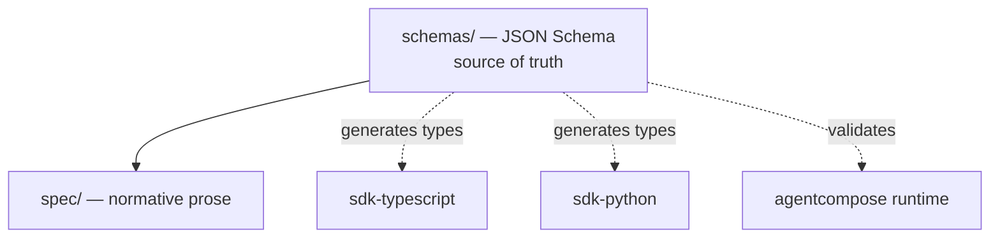

# AgentCompose Specification

> The normative contract that every AgentCompose-compliant agent and orchestrator
> must follow. Language-neutral, schema-first, transport-bound.

**Status:** `Draft` · **Spec version:** `0.1.0` · **License:** Apache-2.0

---

## What this repo is

This repository is the **source of truth** for the AgentCompose contract. It defines
*how* agents and orchestrators interact — not *how* an agent is implemented
internally.

It contains:

| Path | Purpose |
|------|---------|
| [`spec/`](./spec) | The **normative specification** (prose, RFC-style) |
| [`schemas/`](./schemas) | **JSON Schemas** — the machine-readable source of truth |
| [`openrpc.json`](./openrpc.json) | **OpenRPC** method catalog (machine-readable API) |
| [`examples/`](./examples) | Valid example payloads, used in conformance tests |
| [`VERSIONING.md`](./VERSIONING.md) | Compatibility & evolution policy |

This repo contains **no runtime and no SDK**. Those live in separate repos
(`sdk-typescript`, `sdk-python`, `agentcompose` runtime) and are **generated from**
or **validated against** the schemas here.

## Core concepts (at a glance)

- **Agent** — an autonomous component that solves a class of problems. Receives
  **goals, not instructions**. Owns its own models, prompts, memory, tools.
- **Agent Descriptor** — public metadata + capabilities an agent advertises.
- **Task** — a unit of work submitted to an agent toward a goal.
- **Task Lifecycle** — the state machine a task moves through.
- **Artifact** — a tangible output produced during/after a task.
- **Orchestrator** — composes multiple agents into a workflow. A client of the
  contract, not part of an agent's internals.

## The contract surface

Every compliant agent exposes these capabilities over the transport binding:

| Surface | Method | Description |
|---------|--------|-------------|
| Discovery | `agent/describe` / well-known URL | Advertise metadata + capabilities |
| Task submission | `tasks/submit` | Accept a goal, begin work |
| Task query | `tasks/get` | Fetch current task state |
| Provide input | `tasks/provideInput` | Resume a task waiting on input |
| Streaming | `tasks/subscribe` / pushed events | Stream progress, artifacts, result |
| Cancellation | `tasks/cancel` | Request graceful cancellation |

The contract is **transport-neutral**, with two bindings:
[HTTP](./spec/transport.md) (network, SSE) and
[stdio](./spec/transport-stdio.md) (local subprocess, NDJSON). See
[`spec/specification.md`](./spec/specification.md) for normative detail.

## Versioning

The contract evolves under an explicit version (`agentcomposeVersion`) and SemVer.
Backward-incompatible changes bump the major version. See
[`VERSIONING.md`](./VERSIONING.md).

## Status & stability

This is an **early draft (0.x)**. The shape is intended to be durable, but
breaking changes may still occur before `1.0.0`. Feedback and proposals welcome
via issues and RFC-style PRs against `spec/`.

## License

Licensed under the [Apache License 2.0](./LICENSE).
