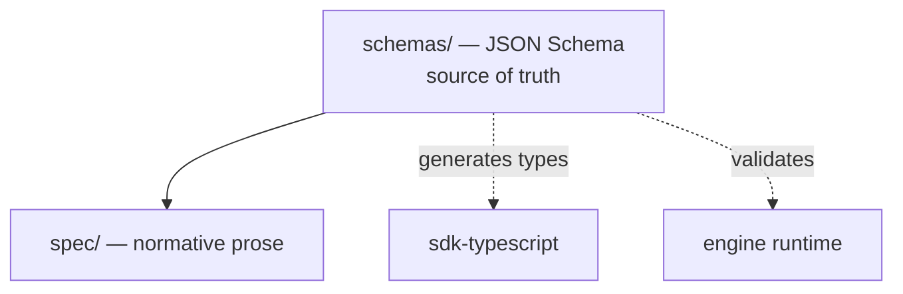

# AgentCompose Specification

> The normative contract that every AgentCompose-compliant agent and orchestrator
> must follow. Language-neutral, schema-first, transport-bound.

**Spec version:** `0.1.0` · **Stability:** early (`0.x`) · **License:** Apache-2.0

Published as [`@agentcompose/spec`](https://www.npmjs.com/package/@agentcompose/spec)
(the JSON Schemas + prose) — `npm install @agentcompose/spec`.

---

## What this repo is

This repository is the **source of truth** for the AgentCompose contract. It defines
*how* agents are configured and interacted with — not *how* an agent is
implemented internally.

An AgentCompose agent is a **reusable, configurable component**: it ships with
defaults and declares a typed configuration surface (model/provider, system
prompt, tools, resources, limits). The contract standardizes that **configuration
surface** and the **interaction surface** (goals in, results out); the agent's
internals stay private.

It contains:

| Path | Purpose |
|------|---------|
| [`spec/`](./spec) | The **normative specification** (prose, RFC-style) |
| [`schemas/`](./schemas) | **JSON Schemas** — the machine-readable source of truth |
| [`openrpc.json`](./openrpc.json) | **OpenRPC** method catalog (machine-readable API) |
| [`examples/`](./examples) | Valid example payloads, used in conformance tests |
| [`guides/`](./guides) | **Non-normative** guidance (e.g. [authoring agents](./guides/authoring-agents.md)) |
| [`VERSIONING.md`](./VERSIONING.md) | Compatibility & evolution policy |

This repo contains **no runtime and no SDK**. Those live in separate repos —
[`sdk-typescript`](https://github.com/agentcompose/sdk-typescript) (the SDK) and
[`engine`](https://github.com/agentcompose/engine) (the orchestration runtime) —
and are **generated from** or **validated against** the schemas here.

## Core concepts (at a glance)

- **Agent (component)** — a reusable, configurable component that solves a class of
  problems. Receives **goals, not instructions**. Internals private; configuration
  surface declared.
- **Agent Descriptor** — public metadata, capabilities, and `configSchema` an agent
  advertises.
- **Configuration** — typed values (with defaults) supplied at instantiation;
  validated against the agent's `configSchema`.
- **Configured instance** — a component bound to a configuration, against which
  tasks run.
- **Task** — a unit of work submitted to a configured instance toward a goal.
- **Task Lifecycle** — the state machine a task moves through.
- **Artifact** — a tangible output produced during/after a task.
- **Orchestrator** — configures and composes agents into a workflow. A client of
  the contract, not part of an agent's internals.

## The contract surface

Every compliant agent exposes these over the transport binding:

| Surface | Method | Description |
|---------|--------|-------------|
| Discovery | `agent/describe` / well-known URL | Advertise metadata, capabilities, configSchema |
| Configuration | `agent/configure` | Supply typed config to instantiate an instance |
| Task submission | `tasks/submit` | Accept a goal, begin work |
| Task query | `tasks/get` | Fetch current task state |
| Provide input | `tasks/provideInput` | Resume a task waiting on input |
| Streaming | `tasks/subscribe` / pushed events | Stream progress, artifacts, result |
| Cancellation | `tasks/cancel` | Request graceful cancellation |

The contract is **transport-neutral**, with two bindings:
[HTTP](./spec/transport.md) (network, SSE) and
[stdio](./spec/transport-stdio.md) (local subprocess, NDJSON). Configuration is
normative in [`spec/configuration.md`](./spec/configuration.md); the full contract
in [`spec/specification.md`](./spec/specification.md).

## Versioning

The contract evolves under an explicit version (`agentcomposeVersion`) and SemVer.
Backward-incompatible changes bump the major version. See
[`VERSIONING.md`](./VERSIONING.md).

## Status & stability

Published at **`0.1.0`** (early `0.x`). The shape is intended to be durable, but
breaking changes may still occur before `1.0.0`. Feedback and proposals welcome
via issues and RFC-style PRs against `spec/`.

## License

Licensed under the [Apache License 2.0](./LICENSE).
