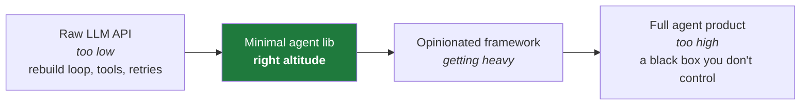
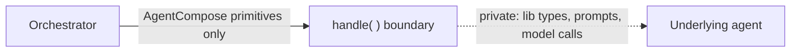
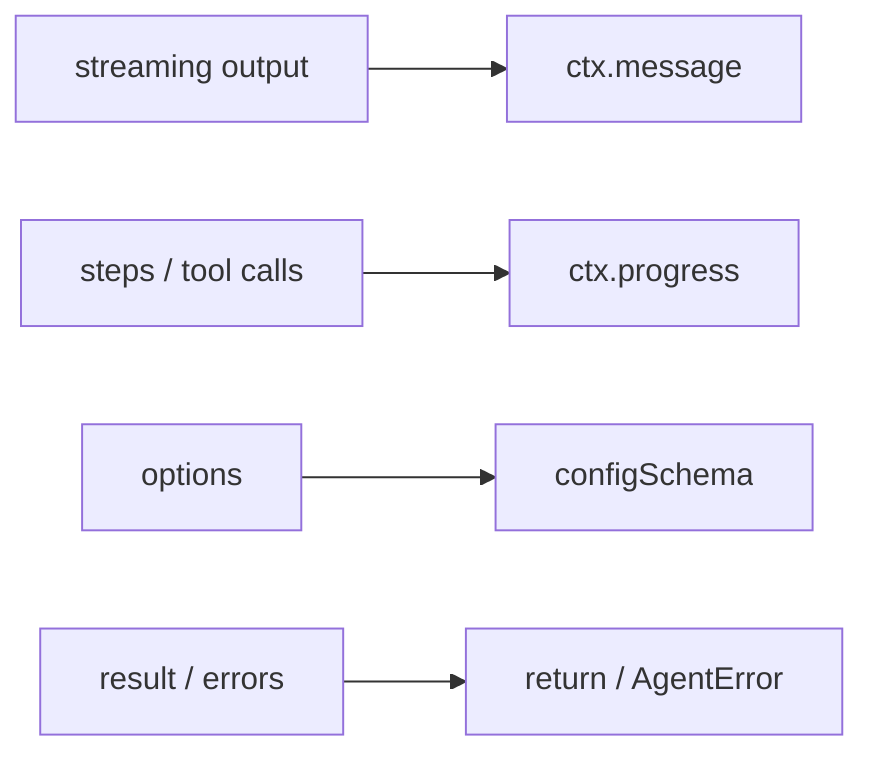

# Authoring Agents — Design Guidance

> **Non-normative.** This guide is advice, not requirements. It describes *how* to
> build a good AgentCompose agent. Nothing here changes the contract in
> [`specification.md`](../spec/specification.md).

An AgentCompose agent is rarely written from scratch. In practice it is an
**adapter**: a thin layer that exposes an *existing* capability — a coding agent, a
retrieval pipeline, a model with tools — as a configurable, composable component.
The protocol is the standard; agents are the adapters (the same way most MCP
servers wrap something that already exists).

These eight principles keep that adapter clean, portable, and pleasant to compose.

---

## 1. Build at the right altitude

Choose the **minimal library whose concepts map naturally** onto AgentCompose.
Don't drop to raw model calls (you'll rebuild the agent loop), and don't wrap a
heavy, opinionated framework (you'll fight its assumptions with glue).



**The test is the mapping itself:** if `handle()` is mostly *translation glue*,
you're too high; if it's reimplementing *plumbing*, you're too low. Pick the
smallest dependency that removes the undifferentiated work — and nothing more.

## 2. Map, don't leak

Translate the underlying tool's world *onto* AgentCompose primitives, and keep its
types, prompts, and opinions **behind** `handle()`. The boundary stays stable even
when the insides change.



A clean mapping usually looks near 1:1:



## 3. Stream as you go

Emit `message` and `progress` events *as work happens* — don't buffer everything
and dump it at the end. Incremental output is what makes a component feel
observable and composable, and lets a caller react or cancel early.

## 4. Honor the contract's controls

Wire `ctx.signal` into the underlying call so cancellation actually stops work.
Surface failures as **coded** errors (`InvalidGoal`, `RateLimited`, …), not raw
stack traces — callers branch on codes, not on message strings.

## 5. Declare only what you honor

Your `configSchema` should expose knobs you actually respect, each with a default
that works out of the box. Capabilities are promises: advertise only what the agent
can really do, with honest input/output modes. Run-on-defaults must always work.

## 6. Stay vendor-neutral at the seam

Prefer model and credentials by **injection** — let the consumer bring their own
model (an OpenAI-compatible `baseUrl`) and pass secrets **by reference**
(`{ secretRef }`), never inline. The same component is then reusable on anyone's
account, model, or budget.

## 7. Keep dependencies light

Agents are frequently spawned as subprocesses (the stdio binding). A small
dependency tree means fast cold starts and easy distribution. Treat every added
dependency as weight the orchestrator pays for at spawn time.

## 8. One instance, one configuration

A configured instance handles tasks under *its* configuration. Don't smuggle global
mutable state across tasks or instances — so the same component can be instantiated
many different ways at once without interference.

---

## A minimal shape

Putting it together, a good adapter is small and mostly mapping:

```ts
defineAgent({
  descriptor: { id, name, capabilities, configSchema },   // declare honestly (5)
  async handle(goal, ctx) {
    const run = underlyingLib.start(goal, {                // right altitude (1)
      model: ctx.config.provider,                          // injected (6)
      signal: ctx.signal,                                  // cancellation (4)
    });
    for await (const step of run.events) {                 // stream as you go (3)
      if (step.kind === "token")  ctx.message({ kind: "text", text: step.text });
      if (step.kind === "tool")   ctx.progress(undefined, step.name);
    }                                                       // lib types never leak (2)
    return [{ kind: "text", text: await run.result }];
  },
});
```

If your real adapter looks roughly like this — thin, declarative, mostly
translation — you're at the right altitude.
