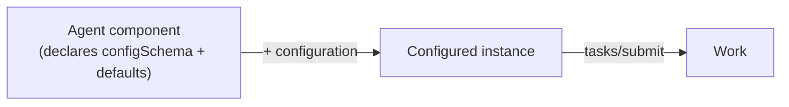

# Component Configuration

**Version:** 0.1.0 · **Status:** Draft

This document is normative. The key words **MUST**, **SHOULD**, **MAY**, etc. are
to be interpreted as in [RFC 2119](https://www.rfc-editor.org/rfc/rfc2119).

---

## 1. Why configuration

An AgentCompose agent is a **reusable component**, not a sealed appliance. Like a
container image, a Helm chart, or a Terraform module, it ships with sensible
**defaults** and exposes a set of **typed, declared knobs** a consumer can set when
they instantiate it.

This draws a precise line:

| Aspect | Visibility |
|--------|-----------|
| **How the agent works inside** — planning, how it calls a model, internal prompts and sub-agents | **Private.** Opaque at invocation. |
| **Its configurable surface** — model/provider, system-prompt additions, granted tools, context resources, limits | **Public, typed, declared.** Set at instantiation. |

The agent's internals remain a black box; its **configuration ports** do not. This
is what makes the same component reusable across contexts: run it as-is, or
configure it for your use.

## 2. Component, configuration, instance

| Term | Definition |
|------|------------|
| **Agent component** | The reusable unit, identified by its descriptor `id`. |
| **Configuration** | A set of values supplied at instantiation. |
| **Configured instance** | A component bound to a specific configuration, against which tasks are submitted. |



## 3. Declaring configuration

A configurable agent **MUST** advertise a `configSchema` in its descriptor: a JSON
Schema (draft 2020-12) describing the configuration object it accepts. Defaults
**SHOULD** be expressed with JSON Schema `default` keywords so the component runs
with no configuration supplied.

An agent that advertises no `configSchema` takes no configuration.

```json
{
  "configSchema": {
    "type": "object",
    "additionalProperties": false,
    "properties": {
      "systemPrompt": { "type": "string" },
      "provider": { "$ref": "https://agentcompose.dev/schemas/config.json#/$defs/Provider" },
      "depth": { "type": "string", "enum": ["shallow", "deep"], "default": "shallow" }
    }
  }
}
```

## 4. Supplying configuration

A consumer supplies configuration with the `agent/configure` method, whose params
validate against [`schemas/agent-configure.json`](../schemas/agent-configure.json):

```
→ {"jsonrpc":"2.0","id":"c1","method":"agent/configure","params":{"config":{"depth":"deep"}}}
← {"jsonrpc":"2.0","id":"c1","result":{"depth":"deep","systemPrompt":null}}
```

Rules:

1. The agent **MUST** merge supplied values over its `configSchema` defaults and
   **MUST** validate the result against `configSchema`.
2. On validation failure the agent **MUST** return `-32007 InvalidConfiguration`,
   with offending paths in `error.data` where practical.
3. On success the agent **MUST** return the **effective configuration** with secret
   values **redacted** (never echo resolved secrets).
4. `agent/configure` **SHOULD** be called before the first `tasks/submit`.
   Configuration scope per binding is defined in §7.
5. Configuration is **instance-level**, not per task. Per-task parameters are a
   separate concern (a future revision).

## 5. Well-known configuration keys

Configuration content is agent-defined, but agents **SHOULD** reuse the well-known
shapes in [`schemas/config.json`](../schemas/config.json) for common knobs, so that
registries and composer tooling can recognize them uniformly (semantic
conventions, not a required envelope):

| Key | Shape | Purpose |
|-----|-------|---------|
| `provider` | `Provider` | Model/provider binding (selection or injection — §6). |
| `systemPrompt` | `SystemPrompt` | Additional/overriding system instructions. |
| `sampling` | `Sampling` | temperature / topP / maxOutputTokens. |
| `tools` | `ToolGrant[]` | Grant external tools (e.g. MCP servers). |
| `resources` | `ResourceRef[]` | Context resources (knowledge, files). |
| `limits` | `Limits` | Budget / token / timeout governance bounds. |

## 6. Model provider: selection vs injection

The `provider` key supports two patterns; an agent **SHOULD** document which it
honors:

- **Selection** — the consumer names a provider/model the agent already supports
  and supplies the credential by reference (`apiKey` as a `SecretRef`).
- **Injection (bring-your-own-model)** — the consumer supplies an
  OpenAI-compatible `baseUrl` plus credential, and the agent routes its model
  calls through that endpoint. This lets a reused component run on the consumer's
  account, budget, and governance.

## 7. Secrets

Secret values (API keys, tokens) **MUST NOT** appear inline in configuration. They
are passed as a `SecretRef` (`{ "secretRef": "NAME" }`) and resolved by the host
out of band:

- Under the **stdio binding**, the host **SHOULD** resolve secret references from
  the child process **environment** (the `secretRef` names an env var).
- Under the **HTTP binding**, secret references are resolved from the deployment's
  secret store.

An agent **MUST NOT** return resolved secret values from `agent/configure`.

## 8. Configuration scope per binding

| Binding | When configured | Scope |
|---------|-----------------|-------|
| **stdio** | `agent/configure` after spawn, before first task; secrets via env | The spawned process (one instance per process). |
| **HTTP** | At deployment (out of band), and/or `agent/configure` | The deployed instance. Per-connection configuration arrives with sessions in a future revision. |

## 9. Conformance

A **configurable** agent:

1. **MUST** advertise a valid `configSchema`.
2. **MUST** validate supplied configuration and return `-32007` on failure.
3. **MUST** run on defaults when no configuration is supplied.
4. **MUST NOT** echo resolved secret values.

An agent with no `configSchema` is conformant and simply ignores `agent/configure`
(returning `-32007` or an empty effective configuration).
