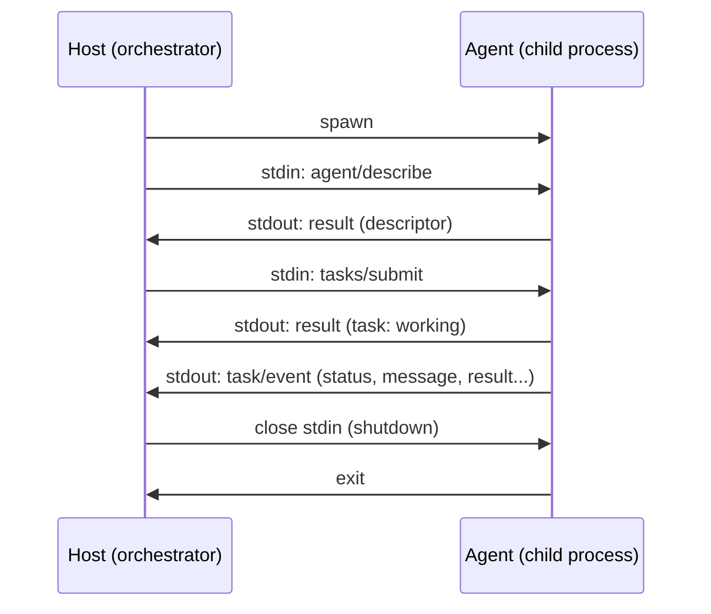

# stdio Transport Binding

**Version:** 0.1.0 · **Status:** Draft

This document is normative. The key words **MUST**, **SHOULD**, **MAY**, etc. are
to be interpreted as in [RFC 2119](https://www.rfc-editor.org/rfc/rfc2119).

The **stdio binding** lets an orchestrator run an agent as a local **child
process** and communicate over the process's standard streams. It is intended for
local composition and polyglot agents (an orchestrator in one language can drive an
agent written in another) without any network, HTTP server, or `endpoint` URL.

It carries the **same** JSON-RPC messages and schemas as the HTTP binding
([`specification.md`](./specification.md) §7) — only the framing, discovery, and
event delivery differ.

---

## 1. Process model

- The orchestrator (the **host**) starts the agent as a child process.
- The host writes JSON-RPC messages to the agent's **stdin**.
- The agent writes JSON-RPC messages to its **stdout**.
- The agent **MAY** write logs/diagnostics to **stderr**. The host **MUST NOT**
  interpret stderr as protocol data.



## 2. Framing (NDJSON)

- Messages are framed as **newline-delimited JSON (NDJSON)**: each message is a
  single JSON value on one line, terminated by `\n` (U+000A).
- A message **MUST NOT** contain an embedded raw newline; serialize without
  pretty-printing.
- Encoding **MUST** be UTF-8.
- Each line **MUST** be a single JSON-RPC message validating against
  [`schemas/jsonrpc.json#/$defs/Message`](../schemas/jsonrpc.json) — i.e. a
  Request, Response, or Notification.
- Batching is **NOT** supported: exactly one message per line.

## 3. Stream discipline

- **stdout is reserved for protocol output only.** The agent **MUST NOT** write
  anything to stdout that is not a JSON-RPC message (no banners, no logging). This
  is the most common implementation mistake; all human-readable output **MUST** go
  to stderr.
- The host **MUST** read stdout line-by-line and dispatch each message by shape
  (response `id` correlation; notifications by `method`).

## 4. Discovery

There is no well-known URL. The host **MUST** obtain the descriptor by calling the
`agent/describe` method:

```
→ {"jsonrpc":"2.0","id":"0","method":"agent/describe"}
← {"jsonrpc":"2.0","id":"0","result":{ ...AgentDescriptor... }}
```

The descriptor's `endpoint` field is **OMITTED** for stdio-only agents. The host
**SHOULD** call `agent/describe` first and check `agentcomposeVersion`.

## 5. Requests and responses

- The host sends Requests with a unique `id`; the agent **MUST** reply with a
  Response bearing the same `id`.
- Methods are identical to the core catalog: `agent/describe`, `tasks/submit`,
  `tasks/get`, `tasks/cancel`, `tasks/provideInput`.
- The agent **MAY** process requests concurrently; responses **MAY** be returned
  out of order (correlate by `id`).

## 6. Events

Unlike HTTP, the stdio channel is already bidirectional and persistent, so there
is no `tasks/subscribe` step:

- The agent **MUST** push task events as JSON-RPC **notifications** with method
  `task/event` and `params` validating against
  [`schemas/event.json`](../schemas/event.json).
- The agent emits these for any active task it created in this session, in causal
  order, and **MUST** stop after a task's terminal event.
- `tasks/subscribe` is **not used** under this binding. If a host sends it, the
  agent **MAY** return the current `Task` snapshot and **MUST NOT** open a second
  channel.

## 7. Errors

Method failures use JSON-RPC `ErrorResponse` objects with the reserved codes from
[`transport.md`](./transport.md) §3. A task-level failure is delivered as an
`error` event notification, not a transport error.

## 8. Shutdown

- The host signals shutdown by **closing the agent's stdin**.
- On stdin EOF, the agent **SHOULD** cancel in-flight tasks, flush any terminal
  events, and exit promptly.
- If the agent does not exit within a host-defined grace period, the host **MAY**
  terminate the process.

## 9. Authentication

The stdio binding has no network surface; trust derives from the host's ability to
spawn the process. Agents **SHOULD** advertise `auth: { "type": "none" }` (or omit
`auth`). Any secrets the agent needs internally are supplied out of band (e.g.
environment variables), never over the protocol.

## 10. Example

A full session is shown in [`examples/stdio-session.jsonl`](../examples/stdio-session.jsonl),
where lines prefixed conceptually by `→` are host→agent (stdin) and `←` are
agent→host (stdout). The file itself contains only the raw JSON-RPC messages, one
per line.
